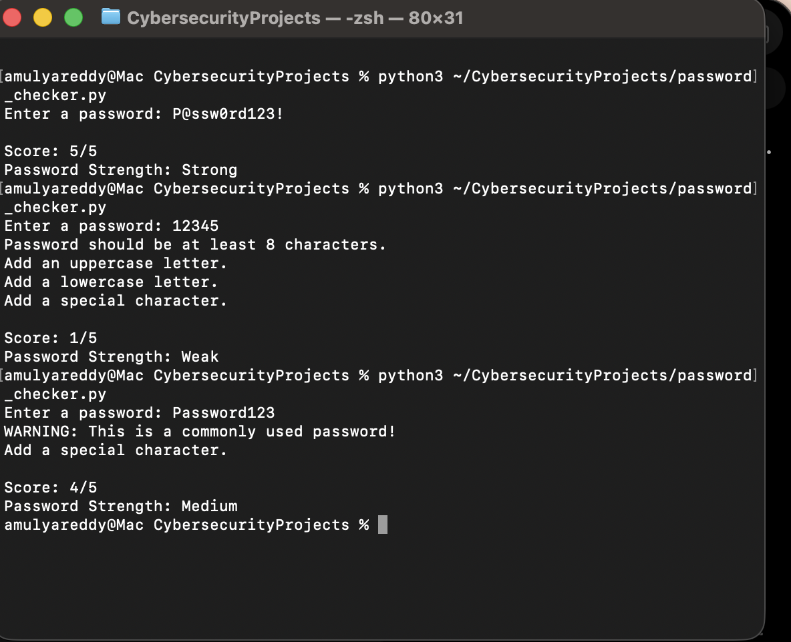

# Password Strength Checker

A Python-based tool that checks the strength of a password.

## Features
- Checks password length
- Checks uppercase letters
- Checks lowercase letters
- Checks numbers
- Checks special characters

## Technologies Used
- Python

## How to Run

1. Download the project
2. Open terminal
3. Run:

```bash
python password_checker.py
```

## Author

Amulya Reddy

## Output


